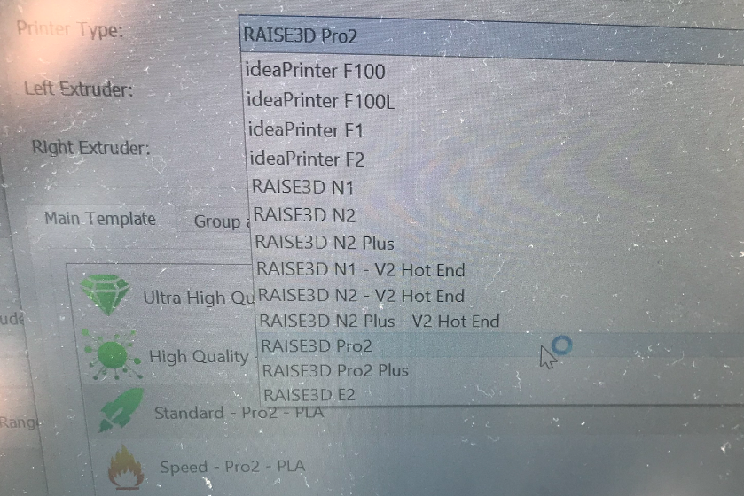
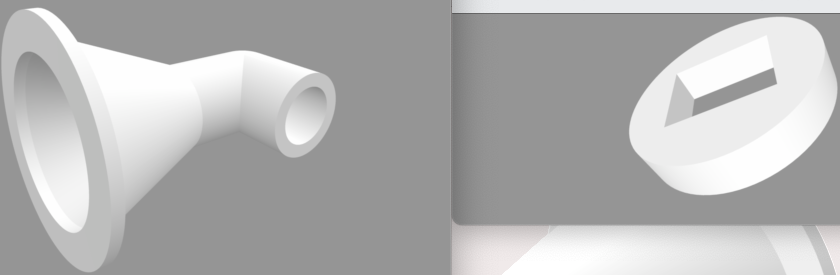
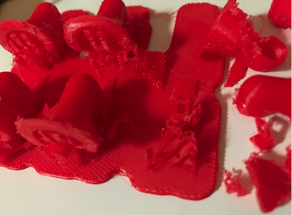
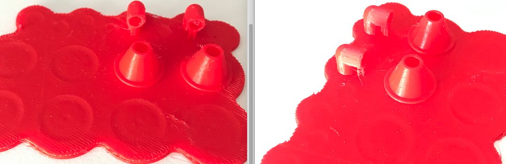
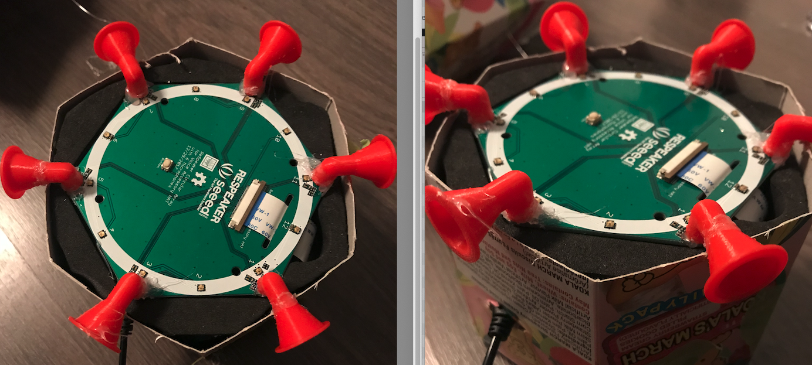
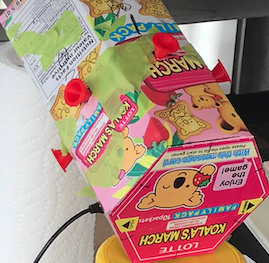

# 3D-Printer-Horn
With the aim to listen to directional sounds by MEMS-fabricated omnidirectional microphones, I plan to design a trumpet/horn-shape cover mounted to the microphones. Current version is v3.

Please also see my [blog](https://people.ryerson.ca/bowu1004/blogs/07/2022/13/3D_printing_of_mic_horn.html) for more details.

## 1. Project Background
With the aim to listen to directional sounds by MEMS-fabricated omnidirectional microphones, I plan to design a trumpet/horn-shape cover mounted to the microphones. It is a microphone horn that can collects more sound energy by covering larger space than its origin.

## 2. Facilities
1. 3D Printer
The 3D printer I plan to use is [Raise3D Pro](https://www.raise3d.com/products/pro2-3d-printer/).

2. Print Software
The slice software for printing is called [ideamaker](https://www.raise3d.com/ideamaker/), which supports .STL/.OBJ/.3MF formats only. I choose to use .OBJ for this project. However, I initially create all the components using _Sketchup_ software. The _ideaMaker_ can actually convert the design from _Sketchup_ to _Raise3D_ printer so that the machine can print.

## 3. Design
Current version of trumpet/horn design is V3.0 and the source design files can be downloaded at [my github page](https://github.com/bowu1004/3D-Printer-Horn).

+ Select the printer type.

+ The actual slicing process demo.

+ Components design
Two components, the top and the bottom that are to be glued together, are designed and printed separately.

## 4. 3D-Printed Horn Samples
It takes about 19min to print out all the components. The v1.0 design turned out to be thin that causes the print-outs collapse/melt (see the pic below).

**The reasons behind this failure:**
+ Need support to the bottom part of the long horn.
+ Need to increase the thickness of the model; Otherwise, it is fragile.
+ Need to increase the squared hole designed for covering the mic.
+ May need to adjust the printing direction.

In current version of v3.0, I increased the thickness of the design. The printed samples are durable (see the pic below).

## 5. Final Appearance

This structure helps the distinguish of the sound directionality at some minor degrees but still need to be further studied.
